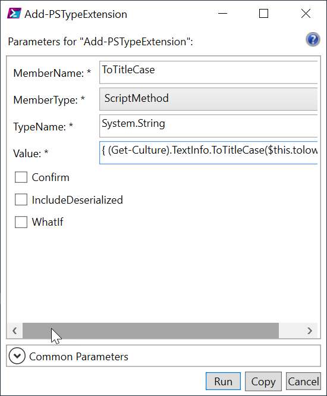

# PSTypeExtensionTools

[](https://www.powershellgallery.com/packages/PSTypeExtensionTools/) [](https://www.powershellgallery.com/packages/PSTypeExtensionTools/)

This PowerShell module contains commands that make it easier to work with type extensions. Many of these commands are wrappers for built-in tools like [Get-TypeData](http://go.microsoft.com/fwlink/?LinkId=821805) or [Update-TypeData](http://go.microsoft.com/fwlink/?LinkId=821871). This module should work in Windows PowerShell 5.1 and PowerShell 7.x.

## Release

You can install the current release from the PowerShell Gallery:

```powershell
Install-Module PSTypeExtensionTools
```

## Why You Want to Use This

Let's say you want to update a number object, but you have no idea what the type name is. Once you have read help for the commands in this module, you could run a PowerShell command like this:

```powershell
123 | Get-PSType | Add-PSTypeExtension -MemberType ScriptProperty -MemberName SquareRoot -Value {[math]::Sqrt($this)}
```

Use `$this` to reference the object instead of `$_`. Now you can get the new property.

```dos
PS C:\> $x = 123
PS C:\> $x.SquareRoot
11.0905365064094
```

Once you know the type name, you can add other type extensions.

```powershell
Add-PSTypeExtension -TypeName system.int32 -MemberType ScriptProperty -MemberName Squared -value {$this*$this}
Add-PSTypeExtension -TypeName system.int32 -MemberType ScriptProperty -MemberName Cubed -value {[math]::Pow($this,3)}
Add-PSTypeExtension -TypeName system.int32 -MemberType ScriptProperty -MemberName Value -value {$this}
Add-PSTypeExtension -TypeName system.int32 -MemberType ScriptMethod -MemberName GetPercent -value {Param([int32]$Total,[int32]$Round=2) [math]::Round(($this/$total)*100,$round)}
```

Here's how it might look:

```dos
PS C:\> $x = 38
PS C:\> $x | select *

      SquareRoot Squared Cubed Value
      ---------- ------- ----- -----
6.16441400296898    1444 54872    38

PS C:\> $x.GetPercent(50)
76
PS C:\> $x.GetPercent(100)
38
PS C:\> $x.GetPercent(110,4)
34.5455
```

### Go GUI

As an alternative to the command-line, you can use the native `Show-Command` cmdlet to display a graphical interface.

```powershell
Show-Command Add-PSTypeExtension
```



Clicking Run will insert this code at your prompt.

```powershell
Add-PSTypeExtension -MemberName ToTitleCase -MemberType ScriptMethod -TypeName System.String -Value { (Get-Culture).TextInfo.ToTitleCase($this.tolower())}
```

If you like this extension, you can export it and re-import it later.

## Get Type Extensions

To see current type extensions, you can use `Get-PSTypeExtension`. You can choose to see all extensions or selected ones by member name. CodeProperty extensions are hidden by default.

```dos
PS C:\> Get-PSTypeExtension system.int32

   TypeName: System.Int32

Name       Type           Value
----       ----           -----
SquareRoot ScriptProperty  [math]::Sqrt($this)
Squared    ScriptProperty  $this*$this
Cubed      ScriptProperty  [math]::Pow($this,3)
Value      ScriptProperty  $this
GetPercent ScriptMethod   Param([int32]$Total,[int32]$Round=2) [math]::Round(($this/$total)*100,$round)
```

If you always want these extensions, you would have to put the commands into your PowerShell profile script. Or you can export the extensions to a JSON or XML file. You can either export all members or selected ones, which is helpful if you are extending a type that already has type extensions from PowerShell.

```powershell
Get-PSTypeExtension system.int32 |
Export-PSTypeExtension -TypeName system.int32 -Path c:\work\int32-types.json
```

In your PowerShell profile scrip,t you can then re-import the type extension definitions.

```powershell
Import-PSTypeExtension -Path C:\work\int32-types.json
```

## PSTypeExtensionTools Cmdlets

### [Add-PSTypeExtension](docs/Add-PSTypeExtension.md)

Add a new type extension such as an `Alias` or `ScriptProperty`.

### [Export-PSTypeExtension](docs/Export-PSTypeExtension.md)

Export type extensions to a json, xml or ps1xml file.

### [Get-PSType](docs/Get-PSType.md)

Get the type name of an object.

### [Get-PSTypeExtension](docs/Get-PSTypeExtension.md)

Get type extensions for a given type.

### [Import-PSTypeExtension](docs/Import-PSTypeExtension.md)

Import type extension definitions from a JSON file or XML.

### [New-PSPropertySet](docs/New-PSPropertySet.md)

In addition to custom properties, PowerShell also has the idea of a _propertyset_. This allows you to reference a group of properties with a single name.

Let's say you have loaded the sample 'System.IO.FileInfo` type extensions from this module.

```powershell
Import-PSTypeExtension -Path $PSTypeSamples\fileinfo-extensions.json
```powershell

You could write a command like this:

```powershell
dir c:\work -file | Select-Object Name,Size,LastWriteTime,Age
```

Or you could create a custom property set. These have to be defined in `ps1xml` files. The `New-PSPropertySet` simplifies this process.

```powershell
New-PSPropertySet -Typename System.IO.FileInfo -Name FileAge -Properties Name,Size,LastWriteTime,Age -FilePath d:\temp\Fileinfo.types.ps1xml
```

I've included the file in the Samples folder.

```dos
PS C:\> Update-TypeData $PSTypeSamples\fileinfo.types.ps1xml
PS C:\> dir c:\work -file | Select-Object fileage

Name                          Size    LastWriteTime            Age
----                          ---- -  -----------              ---
a.dat                            42   2/12/2021 5:36:55 PM     23.17:27:21
a.txt                         14346   12/31/2020 9:10:15 AM    67.01:54:00
a.xml                        171394   12/31/2020 12:15:44 PM   66.22:48:32
aa.ps1                        28866   12/31/2020 9:13:16 AM    67.01:51:00
aa.txt                        28866   12/31/2020 9:11:18 AM    67.01:52:58
about.json                    16455   2/27/2021 10:11:03 AM    09.00:53:12
about_ADReportingTools         1688   3/4/2021 7:37:01 PM      03.15:27:14
b.csv                          1273   11/13/2020 12:11:35 PM   114.22:52:40
...
```

If your property set is using custom properties, you need to load them into your PowerShell session before you can use the property set.

## Create ps1xml Files

The `Export-PSTypeExtension` command will also export extensions to a properly formatted .ps1xml file. This can be useful when building type extension files for a module where you want to use the traditional ps1xml form. You can also import these types of files with `Update-TypeData` with the `-AppendPath` or -PrependPath parameters.

When exporting to .ps1xml file, `Export-PSTypeExtension` has a dynamic parameter, `Append`. This allows you to combine multiple type extensions into a single file. If you intend to use a property set, create that file first. Then append your custom type extensions to that file.

Here's how this might look.

First, create a property set file.

```powershell
New-PSPropertySet -Typename system.io.fileinfo -Name TimeSet -Properties "Name","Length","CreationTime","LastWriteTime" -FilePath c:\work\file.types.ps1xml
```

I'll define a few type extensions.

```powershell
Add-PSTypeExtension -TypeName system.io.fileinfo -MemberType AliasProperty -MemberName Size -Value Length
Add-PSTypeExtension -TypeName system.io.fileinfo -MemberType ScriptProperty -MemberName ModifiedAge -Value {New-TimeSpan -Start $this.lastwritetime -End (Get-Date)}
```

I'll even add a second property set to the same file using these new extensions.

```powershell
Export-PSTypeExtension -TypeName system.io.fileinfo -MemberName Size,ModifiedAge -Path c:\work\file.types.ps1xml -append
```

I'll end up with this file:

```xml
<?xml version="1.0" encoding="utf-8"?>
<!--
This file was created with New-PSPropertySet from the
PSTypeExtensionTools module which you can install from
the PowerShell Gallery.

Use Update-TypeData to append this file in your PowerShell session.

Created 03/09/2021 15:27:56
-->
<Types>
  <Type>
    <Name>System.IO.FileInfo</Name>
    <Members>
      <PropertySet>
        <Name>TimeSet</Name>
        <ReferencedProperties>
          <Name>Name</Name>
          <Name>Length</Name>
          <Name>CreationTime</Name>
          <Name>LastWriteTime</Name>
        </ReferencedProperties>
      </PropertySet>
      <PropertySet>
        <Name>Age</Name>
        <ReferencedProperties>
          <Name>Name</Name>
          <Name>Size</Name>
          <Name>LastWriteTime</Name>
          <Name>ModifiedAge</Name>
        </ReferencedProperties>
      </PropertySet>
      <AliasProperty>
        <Name>Size</Name>
        <ReferencedMemberName>Length</ReferencedMemberName>
      </AliasProperty>
      <ScriptProperty>
        <Name>ModifiedAge</Name>
        <GetScriptBlock>New-TimeSpan -Start $this.lastwritetime -End (Get-Date)</GetScriptBlock>
      </ScriptProperty>
    </Members>
  </Type>
</Types>
```

In PowerShell, I can load this file and use it.

```powershell
PS C:\> Update-Typedata c:\work\file.types.ps1xml
PS C:\> Get-Childitem -path c:\work\*.csv | Sort-Object -property size -Descending | Select Age

Name              Size LastWriteTime          ModifiedAge
----              ---- -------------          -----------
updates.csv    4021821 11/14/2020 9:00:48 AM  115.06:45:35.2595780
part5.csv         7332 2/27/2021 6:10:11 PM   9.21:36:12.4672428
ipperf.csv        5008 11/4/2020 11:36:20 AM  125.04:10:03.4641251
localusers.csv    1480 2/27/2021 4:39:32 PM   9.23:06:51.7431393
b.csv             1273 11/13/2020 12:11:35 PM 116.03:34:48.0298279
foo.csv           1077 11/13/2020 12:40:04 PM 116.03:06:19.3069112
y.csv              524 11/19/2020 2:11:44 PM  110.01:34:39.0826388
yy.csv             524 12/1/2020 11:28:03 AM  98.04:18:20.7080948
c.csv              334 11/13/2020 11:58:15 AM 116.03:48:08.3898463
a.csv                0 12/1/2020 11:30:55 AM  98.04:15:27.9106911
```

I can put the `Update-TypeData` command in my PowerShell profile to always have these extensions. Or I could share the file.

## I Want to Try

You can find sample and demonstration type extension exports in the [Samples](./samples) folder. When you import the module, this location is saved to a global variable, `$PSTypeSamples`.

```powershell
PS C:\> Get-ChildItem $PSTypeSamples


    Directory: C:\scripts\PSTypeExtensionTools\samples


Mode                LastWriteTime         Length Name
----                -------------         ------ ----
-a----       12/15/2017   2:25 PM            766 cimlogicaldisk-extensions.json
-a----        9/28/2018   9:48 AM            265 datetime-extensions.json
-a----       12/15/2017   5:09 PM            232 eventlog-type.json
-a----        2/18/2019   1:18 PM           1266 fileinfo-extensions.json
-a----       11/13/2017   8:37 AM            901 int32-types.json
-a----        11/1/2017   6:18 PM            653 measure-extensions.json
-a----       11/13/2017   8:49 AM            890 process-types.xml
-a----       12/15/2017   6:09 PM            628 README.md
-a----       12/15/2017   2:09 PM           1246 stringtypes.json
-a----        11/9/2017  12:08 PM           3024 vm-extensions.json

PS C:\> Import-PSTypeExtension $PSTypeSamples\measure-extensions.json -Verbose
VERBOSE: Starting: Import-PSTypeExtension
VERBOSE: Importing file C:\scripts\PSTypeExtensionTools\samples\measure-extensions.json
VERBOSE: Processing ScriptProperty : SumKB
VERBOSE: Creating scriptblock from value
VERBOSE: Performing the operation "Adding ScriptProperty SumKB" on target "Microsoft.PowerShell.Commands.GenericMeasureInfo".
VERBOSE: Processing ScriptProperty : SumMB
VERBOSE: Creating scriptblock from value
VERBOSE: Performing the operation "Adding ScriptProperty SumMB" on target "Microsoft.PowerShell.Commands.GenericMeasureInfo".
VERBOSE: Processing ScriptProperty : SumGB
VERBOSE: Creating scriptblock from value
VERBOSE: Performing the operation "Adding ScriptProperty SumGB" on target "Microsoft.PowerShell.Commands.GenericMeasureInfo".
VERBOSE: Ending: Import-PSTypeExtension

PS C:\> Get-ChildItem D:\VMDisks\ -file -recurse | Measure-Object -property length -sum |
select Count,SumGB

Count   SumGB
-----   -----
    4 50.2031
```

This project was first described at <http://jdhitsolutions.com/blog/powershell/5777/a-powershell-module-for-your-type-extensions>

There is an about help topic you can read:

```powershell
help about_PSTypeExtensionTools
```
